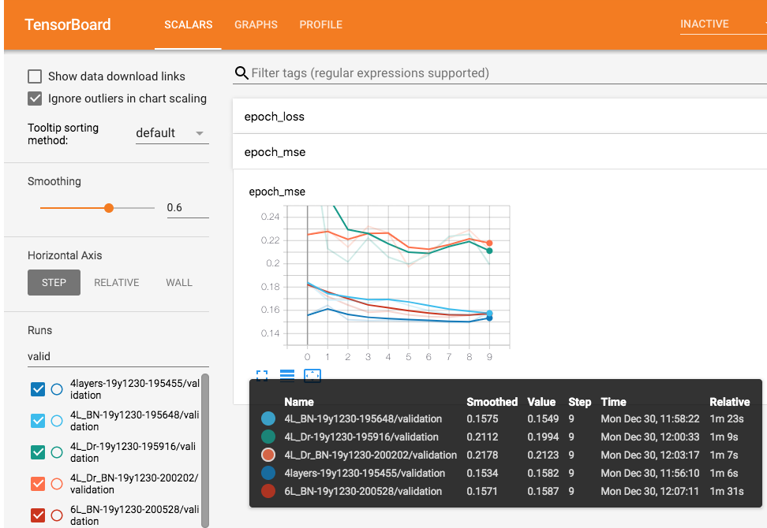

# *cancer omics*
DREAM challenge- Single cell signaling in breast cancer (genomics, transcriptomics, proteomics, phosphoproteomics) [(link)](https://www.synapse.org/#!Synapse:syn20366914/wiki/593925)

# *Biological motivation*

This challenge involves analysis of the largest single cell signaling dataset (67 cancer cell lines). The motivation is to understand the heterogenous, time-dependent responses to multiple drug treatments. In understanding single-cell and cancer line responses to treatments, we aim to predict responses to drug candidates.

[(link)](https://www.synapse.org/#!Synapse:syn20366914/wiki/593925)

This analysis will be broken down into:

1. Exploratory data analysis: Examining time-dependent drug responses and identifying similarities in cell lines. [(link)](https://github.com/jtwang1027/cancer_omics/blob/master/1_EDA_cell_line_exploration.ipynb)

2. Investigating feature importance in predicting phosphorylation changes in response to drug treatment using elastic net (ridge, LASSO) and tree-based models (random forests, xgboost) [(link)](https://github.com/jtwang1027/cancer_omics/blob/master/2A_elastic_net.ipynb)

3. Prediction using neural networks [(link)](https://github.com/jtwang1027/cancer_omics/blob/master/3_neural_network.ipynb)

4. Prediction using automl (tpot) with comparison to the above models. 
