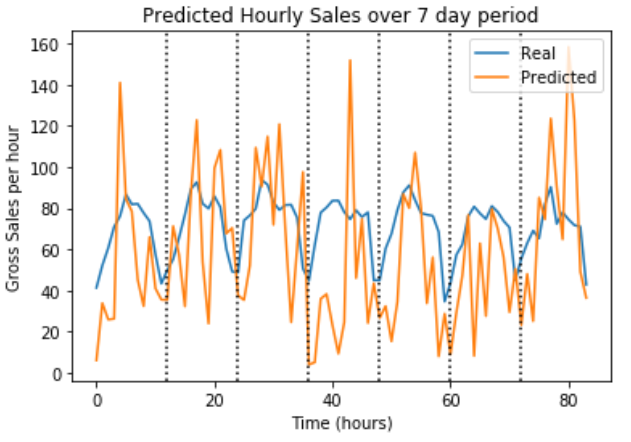

There are many approaches to forecasting time series data. We will explore the application of LSTMs (long short-term memory) to generate predictions on gross sales for a brick and mortar business.

Time series data inherently dependent. To take advantage of this structure, recurrent neural networks (RNNs) allow previous data to influence the current prediction. LSTMs represent a special case of RNNs and can extend the persistence of information used in prediction.

In this scenario, we have the total gross sales generated each hour for an entire year. Using LSTMs, we can train the model to incorporate information from the previous hours, days, or weeks. 

To see the walkthrough, view the ipynb.[(link)](https://github.com/jtwang1027/business_analysis/blob/master/lstm_time_series.ipynb)
